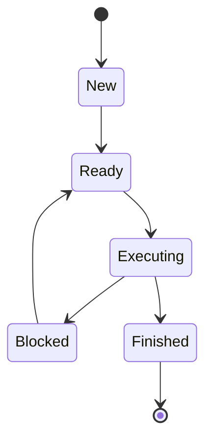

# Batch Processor

A terminal-based process monitor simulator born with a simple batch system (hence the name) written in [Zig](https://ziglang.org/) for my university course on Operating Systems.

Batch Processor lets you create and observe simulated processes as they move through different execution states. The application provides an interactive terminal user interface for configuring processes and monitoring execution statistics in real time.

## Features

- Interactive terminal user interface
- Process queues for:
  - New processes
  - Ready processes
  - Blocked processes
  - Finished processes
- Process state tracking
- Simulated process execution times
- Basic arithmetic operations assigned to processes.
- Process timing metrics, including:
  - Arrival time
  - Response time
  - Service time
  - Return time
  - Waiting time
- Live processor and queue visualization
- Keyboard-driven controls
- Terminal resize handling
- 60 FPS rendering loop

## Requirements

- [Zig](https://ziglang.org/) `0.16.0` or newer
- A terminal emulator with support for an alternate screen and ANSI terminal controls
- A terminal size of at least 125 columns × 30 rows

## Dependencies

This project uses:

- [libvaxis](https://github.com/rockorager/libvaxis) for terminal UI rendering and input handling
- [zeit](https://github.com/rockorager/zeit) for time and duration management

## Building

Clone the repository:

```bash
git clone https://github.com/lizbh26/batch_processor.git
cd batch_processor
```

Build the application:

```bash
zig build
```

The compiled executable will be placed in the Zig installation directory:

```text
zig-out/bin/batch_processor
```

## Running

Run the application directly through the Zig build system:

```bash
zig build run
```

You can also run the compiled executable:

```bash
./zig-out/bin/batch_processor
```

## Testing

Run the test suite with:

```bash
zig build test
```

## How It Works

The application is divided into two main phases.

### 1. Input Phase

The input phase allows you to configure the batch of processes that will be simulated.

Processes contain:

- A unique identifier
- An arithmetic operation
- An estimated execution time
- Timing information used for simulation statistics

### 2. Processor Phase

After the batch is configured, the application switches to the processor view. Processes are moved through the simulated execution context and displayed according to their current state.

The processor manages several queues:



Each process can be completed normally or moved between states based on the processor simulation.

## Process Operations

Supported arithmetic operations include:

| Operation | Symbols |
|-----------|---------|
| Addition | `+` |
| Subtraction | `-` |
| Multiplication | `*`, `x` |
| Division | `/` |
| Remainder | `%`, `mod` |

Examples:

```text
12 + 8
25 - 7
6 * 9
100 / 4
17 % 5
```

Division by zero and invalid expressions are rejected during parsing.

## Keyboard Controls

The application uses keyboard input to navigate and control the simulation.

| Shortcut | Action |
|----------|--------|
| `Ctrl+C` | Exit the application |
| `Ctrl+L` | Refresh the terminal display |

Additional controls may be available depending on the active input or processor view.

## Project Structure

```text
.
├── build.zig
├── build.zig.zon
└── src
    ├── controller.zig
    ├── main.zig
    ├── root.zig
    ├── models
    │   ├── context.zig
    │   ├── operation.zig
    │   ├── process.zig
    │   └── queue.zig
    ├── utils
    │   ├── count_utf8.zig
    │   ├── leftpad.zig
    │   ├── time.zig
    │   └── usize_to_smaller.zig
    └── view
        ├── main_orchestrator.zig
        ├── input
        └── processor
```

### Core Components

- `controller.zig` initializes the terminal, processes input events, manages the render loop, and coordinates screen updates.
- `models/context.zig` manages the execution context and process queues.
- `models/process.zig` defines process state and timing metrics.
- `models/operation.zig` defines arithmetic operations and expression parsing.
- `models/queue.zig` provides a generic doubly linked queue.
- `view/input` contains the process configuration interface.
- `view/processor` contains the process execution and monitoring interface.
- `utils` contains shared helper functions.

## Development Commands

Display available build commands and options:

```bash
zig build --help
```

Build with a specific optimization mode:

```bash
zig build -Doptimize=ReleaseFast
```

Build for a specific target:

```bash
zig build -Dtarget=<target>
```

Run with application arguments:

```bash
zig build run -- <arguments>
```

## License

This project is licensed under the GNU General Public License v3.0. See [LICENSE](LICENSE) for details.

